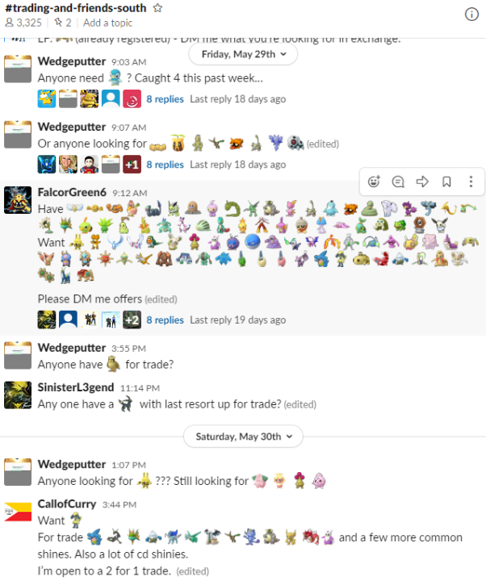

# Personal Project Pogo Shiny
## IDEA and USER:

A website accessible from mobile or computer where users can create accounts to track what shiny pokemon they have in Pokemon Go and what they are willing to trade. Currently most trades are arranged either in person or via Discord or Slack, depending on location. In the local Utah Valley slack server, trading usually works like this:



Custom emojis added to the slack channel serve as identifiers for the pokemon to be traded, but the format isn't ideal in my opinion. My goal is for people to be able to share their user profile (e.g. http://pogoshiny.com/user/darlson) so others can view their shiny collection and what they have available to trade. They can then reach out to each other to arrange offers and trades.

Target users are people who regularly play Pokemon Go and desire to catch 'em all.

## Features:
##### MVP:
- Clean user interface displaying their shiny pokemon, whether to show off or to trade
- Simple URL for sharing purposes
- Authenticated locks for editing, so that only the user logged in can edit a user's list
- Email verification for account creation
- Toggle to identify all pokemon, all tradeable, or all not-tradeable

##### Ideal but not necessary:
- List sortable by pokemon name, number, trade status, and CP
- Functionality to search a region and find users with a certain pokemon for trade
- External contact information for a user's Slack/Discord/GroupMe integrated on their app profile
- Ability to add friends in the app
- Expansion to include all tradeable pokemon, not just Shiny pokemon

## Website colors:


## View/ Controller:
- View 1 is the homepage and authentication view, with login and register options
- View 2 is the pokemon list page, on which people can view their pokemon and also add pokemon to their collection
- View 3 is where a user can edit their profile information
- A nav bar at the top will allow a user to access the different views and be able to log out

## Routes
- / - Home and Authentication
- /user/${username} - user list view and add functionality
- /user/profile - user profile page and edit information

## Endpoints


## Controllers


## Schema (Database Design):

### Roles TABLE
```SQL
CREATE TABLE roles(
    id SERIAL PRIMARY KEY,
    name VARCHAR(20),
);

--EXAMPLE DUMMY DATA
INSERT INTO users
(name)
VALUES
('User'),
('Admin');
```

### Users TABLE
```SQL
CREATE TABLE users(
    id SERIAL PRIMARY KEY,
    username VARCHAR(50),
    password VARCHAR(50),
    role_id INT REFERENCES roles(id)
);

--EXAMPLE DUMMY DATA
INSERT INTO users
(username, password, profile_pic)
VALUES
('darls0n', 'd', 2),
('wanderlass', 'd', 1);
```
### User Info TABLE
```SQL
CREATE TABLE user_info(
    info_id SERIAL PRIMARY KEY,
    first_name VARCHAR(30),
    last_name VARCHAR(30),
    alt_name VARCHAR(100)
    location VARCHAR(50),
    user_id  INT REFERENCES users(id) 
);

--EXAMPLE DUMMY DATA
INSERT INTO user_info
(first_name, last_name, alt_name, location, user_id)
VALUES
('David', 'Carlson', 'darlson', 'Utah Valley', 1);
```
### Pokemon Table
```SQL
CREATE TABLE pokemon(
    poke_id SERIAL PRIMARY KEY,
    name VARCHAR(30),
    number INT,
    trade BOOLEAN
    CP INT,
    user_id  INT REFERENCES users(id) 
);
INSERT INTO pokemon
(name, trade, CP, user_id)
VALUES
('Dragonite', false, 3792, 1),
('Mewtwo', true, 2920, 1),
('Sandshrew', true, null, 2);
```